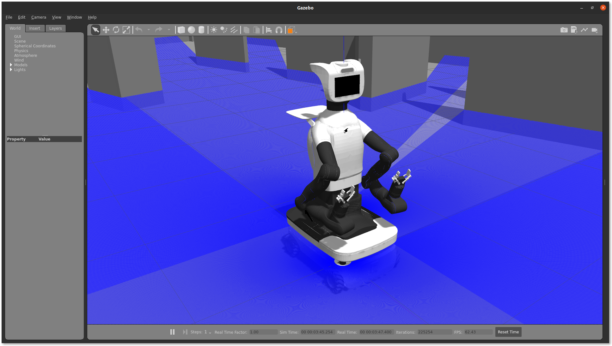

# 🧠 Exercise 1 — Lanzar la simulación e inspeccionar TIAGo PRO

En este primer ejercicio aprenderás a **lanzar la simulación de TIAGo PRO** y a **explorar su estructura interna** usando los comandos básicos de ROS 2.

---

## 🚀 Lanzar la simulación

Asegúrate de haber compilado correctamente el workspace y de tener todas las dependencias instaladas.

Primero, intenta lanzar la simulación con el comando básico:

```bash
ros2 launch tiago_pro_gazebo tiago_pro_gazebo.launch.py
```

Verás que la simulación no se iniciará y aparecerá un mensaje de error:

```bash
[ERROR] [launch]: Caught exception in launch (see debug for traceback): You are using the public simulation of PAL Robotics, make sure the launch argument is_public_sim is set to True
```

Esto sucede porque los paquetes públicos de PAL Robotics requieren especificar explícitamente que estás ejecutando una simulación pública.

Para iniciar correctamente la simulación, añade el argumento `is_public_sim:=True`:
```bash
ros2 launch tiago_pro_gazebo tiago_pro_gazebo.launch.py is_public_sim:=True
```

Esto abrirá Gazebo con el robot TIAGo PRO en un entorno de simulación.




### ⚙️ Explorar argumentos disponibles

Puedes explorar todas las opciones que acepta el launch file usando:
```bash
ros2 launch tiago_pro_gazebo tiago_pro_gazebo.launch.py --show-arguments
```

Esto mostrará una lista de argumentos posibles y sus valores por defecto. Por ejemplo:

```bash
Arguments (pass arguments as '<name>:=<value>'):

    'base_type':
        Base type. Valid choices are: ['omni_base']
        (default: 'omni_base')

    'arm_type_right':
        Arm type right. Valid choices are: ['tiago-pro', 'tiago-pro-s', 'no-arm']
        (default: 'tiago-pro')

    'arm_type_left':
        Arm type left. Valid choices are: ['tiago-pro', 'tiago-pro-s', 'no-arm']
        (default: 'tiago-pro')
```

Puedes lanzar la simulación pasando los argumentos deseados así:

```bash
ros2 launch tiago_pro_gazebo tiago_pro_gazebo.launch.py is_public_sim:=True arm_type_right:=no-arm
```

⚠️ Atención: No todos los argumentos funcionarán en la simulación pública, porque algunos requieren dependencias adicionales o son funciones premium de PAL Robotics.
Se recomienda usar solo las combinaciones soportadas para la simulación pública.

## 🔎 Explorar los tópicos de ROS 2

Para inspeccionar los datos que el robot publica y recibe, es útil abrir **varios terminales**.  
Se recomienda usar **Terminator** para abrir múltiples ventanas de terminal de forma simultánea.

Si no tienes Terminator instalado, puedes instalarlo con:

```bash
sudo apt install terminator -y
```

Abre Terminator:
```bash
terminator -u
```

Divide la ventana en dos paneles (clic derecho → Split Horizontally o Split Vertically).
En el primer panel, lanza la simulación de TIAGo PRO:

```bash
ros2 launch tiago_pro_gazebo tiago_pro_gazebo.launch.py is_public_sim:=True
```

En el segundo panel, lista los tópicos activos en ROS 2:

```bash
ros2 topic list
```

Ahora puedes observar en tiempo real los tópicos que se publican mientras la simulación está corriendo.
En el panel de ROS 2, puedes inspeccionar algunos tópicos importantes con:
```bash
ros2 topic echo /scan_front_raw
ros2 topic echo /mobile_base_controller/cmd_vel
ros2 topic echo /head_front_camera/color/image_raw
```

💡 Consejo: Para tópicos con mucha frecuencia de publicación, usa `--once` para limitar los mensajes:

```bash
ros2 topic echo --once /head_front_camera/color/image_raw
```