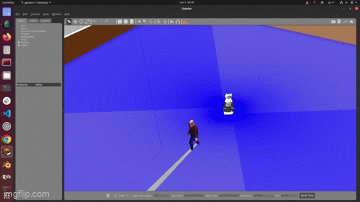

# 🧍‍♂️ Demo “Follow Me” — Detección de Objetivos y Seguimiento
Este ejercicio muestra cómo preparar la simulación para utilizar el Target Detector Server y ejecutar la demo de seguimiento autónomo de personas u objetos en movimiento (Follow Me).
El robot TIAGo PRO será capaz de detectar un objetivo (falso o humano) y navegar dinámicamente para seguirlo.

Esto permite comportamientos autónomos de seguimiento de personas u objetos en movimiento.

## 🧩 1. Preparar el entorno

Asegúrate de haber completado los pasos de instalación del workspace (exercise_0) y de que tienes la carpeta compartida `exchange` configurada.

Copia el paquete del tutorial de detección dentro de tu workspace:


```bash
cd ~/exchange/tiago_pro_roscon_es_2025_workshop/exercises/exercise_4
mv target_detection_tutorial/ ~/exchange/ws_tiago_pro_workshop/src/
```

Instala dependencias y compila:
```bash
cd ~/exchange/ws_tiago_pro_workshop
rosdep install --from-paths src --ignore-src -r -y
source /opt/ros/humble/setup.bash
colcon build
``` 

## 🌍 2. Activar el actor en la simulación

Abre el archivo del mundo y descomenta el bloque del actor:

```bash
cd ~/exchange/ws_tiago_pro_workshop/src/pal_gazebo_worlds/worlds
gedit roscon_es_25.world
``` 
Busca esta sección y copia y pega esto:
```bash
<actor name="random_actor">
      <static>false</static>
      <skin>
        <filename>moonwalk.dae</filename>
        <scale>1.0</scale>
      </skin>
      <animation name="walking">
        <filename>walk.dae</filename>
        <scale>1.0</scale>
        <interpolate_x>true</interpolate_x>
      </animation>
      <plugin name="random_actor_plugin" filename="librandom_actor_plugin.so">
        <world_limits>
          <x_min>-5.0</x_min>
          <x_max>5.0</x_max>
          <y_min>-5.0</y_min>
          <y_max>5.0</y_max>
        </world_limits>
        <hri_simulation>true</hri_simulation>
      </plugin>
</actor>
``` 


Guarda y recompila:

```bash
cd ~/exchange/ws_tiago_pro_workshop
colcon build
```

## ⚙️ 4. Configurar el Behavior Tree para seguimiento dinámico

Edita el archivo de configuración de navegación:
```bash
gedit ~/exchange/ws_tiago_pro_workshop/src/omni_base_navigation/omni_base_2dnav/config/nav_public_sim.yaml
```

Añade estas líneas dentro de `bt_navigator`:
```bash
bt_navigator:
  default_nav_to_pose_bt_xml: "~/exchange/ws_tiago_pro_workshop/src/target_detection_tutorial/behavior_trees/navigate_to_dynamic_target.xml"

  plugin_lib_names:
    - pal_nav2_detect_target_action_bt_node
    - pal_nav2_transform_pose_decorator_bt_node
```

Guarda los cambios y recompila:
```bash
cd ~/exchange/ws_tiago_pro_workshop
colcon build
source install/setup.bash
```

## 🎯 5. Lanzar la demo con el Dummy Target Detector

En una terminal:
```bash
ros2 launch target_detection_tutorial target_detection.launch.py
```
En otra terminal (cuando el detector esté cargado):
```bash
ros2 launch tiago_pro_gazebo tiago_pro_gazebo.launch.py is_public_sim:=True navigation:=True world_name:=roscon_es_25
```
Cuando todo esté listo, envía un 2D Nav Goal en RViz.
El `bt_navigator` cargará el BT navigate_to_dynamic_target.xml y el robot se moverá hacia el objetivo detectado (en este caso, un punto 2 metros delante).

💡 Para detener el seguimiento: cancela el goal activo de navegación o envía uno incorrecto (por ejemplo, con un frame_id erróneo).

## 🧠 6. Usar el Human Target Detector

Para usar el detector real de personas (hri), modifica el código del paquete target_detection_tutorial:

- En `package.xml` descomenta:

```bash
<depend>hri</depend>
```

- En `CMakeLists.txt` descomenta:

```bash
find_package(hri REQUIRED)
...
hri
```

-  En `src/dummy_target_detector.cpp`  descomenta las líneas relacionadas con hri:

```bash
#include "hri/hri.hpp"
```

En el método configure:

```bash
hri_listener_ = hri::HRIListener::create(node);
hri_listener_->setReferenceFrame("base_footprint");
RCLCPP_INFO(logger_, "HRI Listener initialized in %s", plugin_name_.c_str());
```

En el método detectTarget:

```bash
auto bodies = hri_listener_->getBodies();
for (auto const & [body_id, body]: bodies)
{
  RCLCPP_DEBUG(logger_, "Body detected = %s", body_id.c_str());
  if (auto bodyTransform = body->transform())
  {
    geometry_msgs::msg::TransformStamped transform_stamped;
    transform_stamped.header = bodyTransform->header;
    transform_stamped.child_frame_id = bodyTransform->child_frame_id;
    transform_stamped.transform = bodyTransform->transform;
    detected_targets[id] = std::make_pair(transform_stamped, accuracy);
    return true;
  }
}
```

Y comenta las líneas del dummy target:

```bash
// transform.header.frame_id = "base_footprint";
// transform.child_frame_id = "target";
// transform.header.stamp = clock_->now();
// transform.transform.translation.x = 2.0;
// detected_targets[id] = std::make_pair(transform, accuracy);
// return true;
```

En la parte privada descomenta:

```bash
std::shared_ptr<hri::HRIListener> hri_listener_;
std::vector<hri::ID> bodies_facing_robot_;
```

Recompila todo:

```bash
cd ~/exchange/ws_tiago_pro_workshop
colcon build
```

## 🧍‍♀️ 7. Ejecutar la simulación con detección humana

Lanza el target detector con soporte HRI:

```bash
ros2 launch target_detection_tutorial target_detection.launch.py
```

En otra terminal, lanza la simulación:
```bash
ros2 launch tiago_pro_gazebo tiago_pro_gazebo.launch.py is_public_sim:=True navigation:=True world_name:=roscon_es_25
```

Envía un 2D Nav Goal desde RViz.
El robot comenzará a seguir al actor (persona simulada).

### 🖼️ Resultado esperado

El robot TIAGo PRO sigue al actor que se mueve por el escenario, utilizando la navegación dinámica y el detector de objetivos humano.


